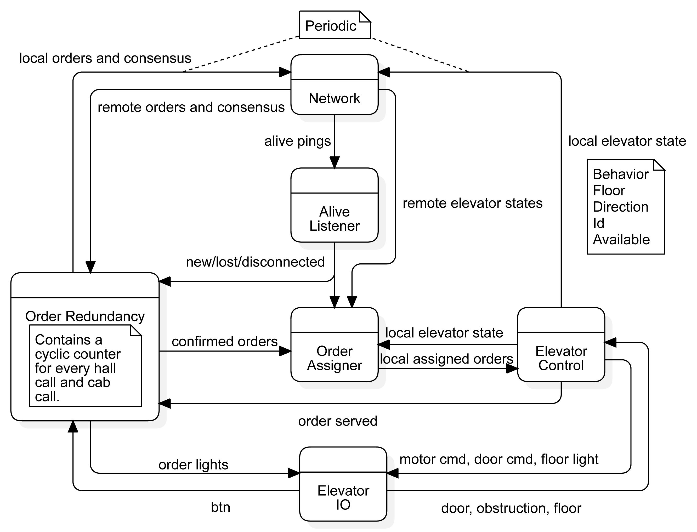

# A peer-to-peer distributed system for controlling n elevators with m floors. 

## How to run
1. Open a terminal window
2. Clone this git repository and open it in the terminal. 
3. Initialise new elevator in terminal:
`go run main.go -id="[id]"`

## Set parameters
Different parameters, including N_FLOORS, can be set in the constants.go file. 

## Module overview

* al    - alive_listener:	Listens to pings from other elevators on network, maintains list of alive elevators.
* ec	- elevator_control:	Controls the elevator to take all asigned orders (input).
* eio	- elevator_io:		Polls hardware.
* net	- network:		Sends and recieves orders, elevator states and alive pings over network.
* oa	- order_assigner:	Recieves orders and states from all elevators and "optimally" assigns these between elevators.
* or	- order_redundancy:	Handles state transitions of orders. Order states are UNKNOWN, NONE, UNCONFIRMED and CONFIRMED.

  
The module diagram is shown below:

## The Order Redundancy module
This module keeps track of the order state of both cab and hall calls. 
The following finite state machine describes the transitions: